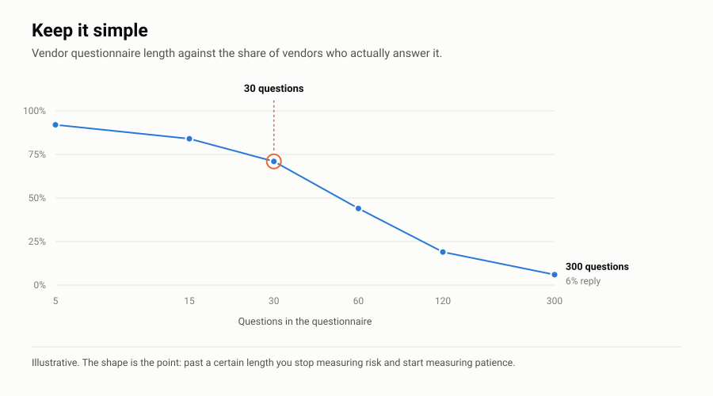
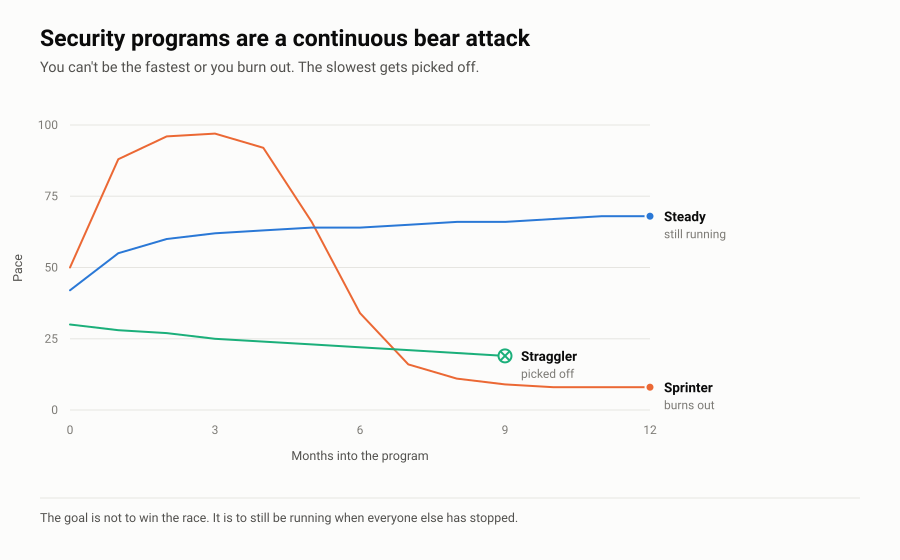
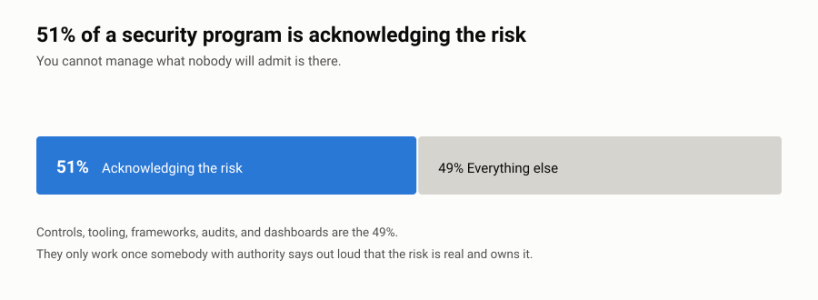
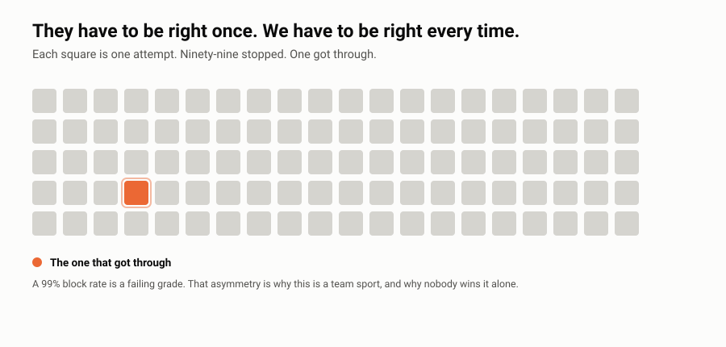

# Principles

Eleven things I say a lot. Say them enough and people start saying them back to you, which is how you know they were worth saying.

Everything I publish here comes out of these.

---

## Security Shouldn't Be Paywalled

Most of what a company needs to be safer isn't secret. It isn't clever. It isn't hard.

It's just locked up. Behind a consulting engagement, a vendor demo, a form that wants your email and your headcount before it'll show you a checklist.

That bugs me. So I'm putting the stuff I'd hand a client on day one out here for free. No form. No email capture. Licensed so you can use it commercially and I don't want anything for it.

If you can afford to hire somebody, hire somebody. If you can't, you still deserve to not get breached.

## Keep It Simple. Look at the Bathroom Door.

Go into any public restroom and there's a piece of paper on the back of the door. Date, time, initials. Somebody checked this at 2:15, and here's who.

That's a control. It's got an owner, a schedule, an audit trail, and evidence it ran. Cost about a nickel.

Nobody built an app for it. Nobody put a sensor on the soap dispenser and piped it to a dashboard. Because it works. If somebody had a better system, they'd have put it up there.

Now look at what we do. The 300-question vendor questionnaire that measures patience instead of risk. The 40-page policy nobody opens. The maturity model with five dimensions and four levels each, which isn't a plan, it's a spreadsheet somebody built to look thorough.

Complicated things fail quietly. They fail right when you needed them to work.

Thirty good questions beat three hundred. Two pages beat forty. Three priorities beat twenty. A sheet of paper on a door beats a dashboard nobody opens.

<picture>
  <source media="(prefers-color-scheme: dark)" srcset="charts/keep-it-simple-dark.svg">
  
</picture>

## Security Is a Team Sport

No security team has ever secured a company.

Engineers ship code. Admins hand out access. Finance pays invoices. Somebody at the front desk holds the door. That's where security actually happens. Not in a document with my name on it.

So most of this job is persuasion. Translation. Making the right thing the easy thing.

A control nobody follows is a Word file. A policy somebody can actually read is a control.

## Don't IT an HR Problem

Somebody downloads the customer list the week before they resign. The reflex is to go buy DLP.

But that's not a tooling problem. That's a manager who didn't know their person was leaving, an offboarding process that starts too late, and probably a reason that person is walking out the door in the first place. You can spend six figures on a tool that flags it thirty seconds faster and change nothing.

Same thing all over the place. Somebody fails phishing tests over and over, that's a performance conversation, not a new gateway. People are sharing passwords, that's usually because access provisioning takes four days. Shadow IT means somebody routed around a tool that doesn't work for them.

Tools are great at technical problems. Half of what lands on the security team isn't one.

Ask what's actually happening before you go shopping. Sometimes the fix is a conversation, and the conversation isn't yours to have.

## Shadow IT Is a Symptom, Not a Disease

Nobody wakes up wanting to break policy. When somebody's running a tool you didn't approve, it's almost always one of four things.

**They're blocked.** They have a job to do and the sanctioned path doesn't get them there. So they found one that does. That's not defiance, that's somebody trying to hit their number.

**They know a better tool exists.** Because they used it at their last job, or a peer showed them. And the thing we handed them is worse. They're not wrong.

**They don't know what they already have.** This one's on us. I've watched a team buy a project tool while the same capability sat unused in a license they'd been paying for since 2021. Nobody told them. Nobody trained them. It wasn't in the onboarding.

**Marketing got to them first.** Somebody spent millions making sure your employee heard about a product before they heard from you. You are competing for attention with an ad budget, and you're losing.

The best example is consumer "privacy" VPNs.

There are real security reasons to run a VPN. Almost none of them apply to somebody scrolling Facebook on hotel wifi. But the ads are everywhere, they're on every podcast, and they've convinced a lot of smart people that a VPN is a security control.

Meanwhile Kape Technologies owns ExpressVPN, CyberGhost, Private Internet Access, and ZenMate. Kape used to be called Crossrider, whose browser-extension platform was widely used by ad injectors before the company rebranded in 2018 and pivoted to selling privacy products.

So the thing being sold to your employees as privacy is, in several cases, owned by a company that built its business on the opposite of privacy. That's the marketing you're up against. It is very good marketing.

You do not fix any of this with a block rule. You fix it by asking the four questions above and then actually doing something about the answers.

Yell at somebody for shadow IT and you don't get less of it. You get better-hidden shadow IT, and you lose the only person who was going to tell you about the next one.

## Security Starts at Home

The best awareness program I ever ran had almost nothing to do with work.

Teach somebody to put a password manager on their own phone. Get them to turn on MFA for their bank. Show them how to lock down their kid's tablet. Help them freeze their credit.

They'll actually do it, because it's their money and their family. And once they've done it at home, doing it at work stops being a corporate rule and starts being a habit they already have.

Run it the other way and you get compliance theater. Annual training, click through it, forget it by lunch.

The people who lock down their own stuff are the ones who notice something's off at work. You can't buy that. You grow it, and you grow it at their kitchen table.

The easiest version of this costs nothing. If you're on [Bitwarden Enterprise](https://bitwarden.com/help/families-for-enterprise/), every employee already gets a free Families plan. Them plus five people, all premium features, no extra charge, as long as they work there. Most companies buy it and never tell anybody.

Turn it on. Send one email. Now your people are running a password manager at home, their spouse is on it, their kid is on it, and you didn't spend a dollar or run a single training module.

That's the whole play. Find the thing that helps them personally and get out of the way.

## Security Programs Are a Continuous Bear Attack

You don't have to outrun the bear. You have to not be the slowest.

But you can't sprint either. I've watched people go all out for two quarters, produce a mountain of work, and burn their whole team down doing it. Program dies right alongside their enthusiasm.

Too slow and you're the one that gets eaten.

The job is finding a pace you can hold for years. Not winning. Still running when everybody else quit.

<picture>
  <source media="(prefers-color-scheme: dark)" srcset="charts/bear-attack-dark.svg">
  
</picture>

## 51% of a Security Program Is Acknowledging the Risk

Every real fix I've been part of started the same way. Somebody senior said out loud that a risk was real, and put their name next to it.

Controls, tools, frameworks, audits. That's the other 49%. All useful. All dead weight until somebody admits the problem exists.

You can't manage what nobody will say.

Most stuck programs aren't stuck on money or tooling. They're stuck because nobody wants to be the one who says it.

<picture>
  <source media="(prefers-color-scheme: dark)" srcset="charts/fifty-one-percent-dark.svg">
  
</picture>

## The Bad Guys Only Have to Be Right Once. We Have to Be Right Every Time.

That's the whole shape of this job. It's why it wears people out. It's why chasing perfect is a trap.

It's also why 99% is a failing grade, and why you cannot do this by yourself. One person can't be right every time. Nobody can. A company where everybody is paying a little attention gets close.

<picture>
  <source media="(prefers-color-scheme: dark)" srcset="charts/asymmetry-dark.svg">
  
</picture>

## No One Is as Dumb as All of Us

Put enough smart people in a room and they'll agree on something none of them would have done alone.

Committees write policies nobody would sign their own name to. Consensus lands on whatever nobody objects to, which is almost never the thing that works.

The answer isn't fewer people. It's naming one owner. Running the tabletop before the incident. Making it cheap and safe for somebody to say "hang on, this is wrong."

Half the value of an exercise is watching four people realize they each thought somebody else had it.

## Notes on a Cocktail Napkin in Sharpie Beat Nothing

The perfect IR plan you haven't written does nothing for you at 2am. The napkin with four names and three phone numbers does.

I've seen more programs die waiting on the right template, the right platform, the right consultant, than ever died from starting rough.

Ship the napkin. Fix it next quarter.

Everything in this account is a napkin somebody already scribbled on. Take it. Write over it. Make it yours.

---

## Why This Is Here

Anybody can list principles. These ones do work. Every repo here comes out of them, and if something I've published contradicts one, the published thing is wrong.

Tell me when that happens. [SECURITY.md](SECURITY.md).

---

**Harrison Ward** · Cyber risk and technology exec
[github.com/HarrisonWard](https://github.com/HarrisonWard) · [LinkedIn](https://linkedin.com/in/harrisonaward)

[CC BY 4.0](https://creativecommons.org/licenses/by/4.0/). Use it, change it, quote it. Just say where you got it.
